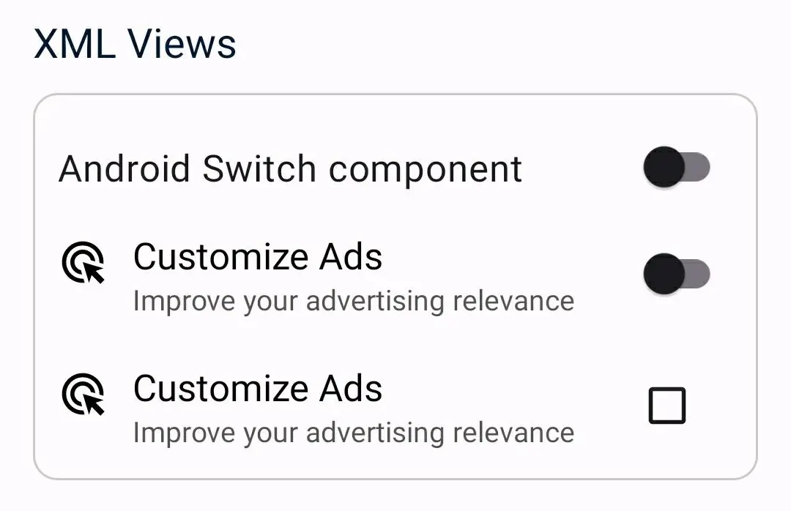

XML View implementation showing the use of custom toggleable Views with suitable accessibility configuration.

You can start exploring the implementation from the [ToggleablesView](ToggleablesView.kt).

[CheckboxCustomComponent](CheckboxCustomComponent.kt) and [SwitchCustomComponent](SwitchCustomComponent.kt) are examples of how to create a custom Toggleable with a proper accessibility configuration.
>[!NOTE]
>These two custom components are explained in detail in [Improve your Android accessibility with toggleables](https://medium.com/@cononube/improve-your-android-accessibility-with-toggleables-b6f7239f35e1) Medium post.

   

